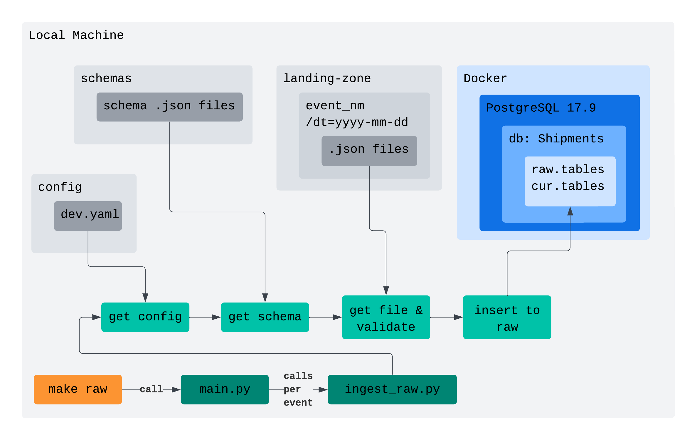

# Shipment Events

## Intro

Welcome to my `shipment-events` repo, where I'm working on some data pipelines for, you guessed it, shipment events!

Want to read about the project? Check the [project blog](BLOG.md).

---

## Project Documentation

### Layout

Some stuff I thought worth pointing out in the project (not everything):
```
project-structure/
├── Makefile         # for now, install dependencies, compose containers, run pipelines 
├── config/          # yaml for reusability (preparing for different environments maybe?)
├── db /              
│   └── model        # curated (silver) model
├── landing-zone/    # sample events I created
├── learnings/       # a folder of all of my notes I'm taking as I go through this
├── schemas/         # event schemas for the shipment events!
├── src/             # python stuff
├── blog.md          # day to day updates about the project and what I'm learning
└── readme.md        # project docs + I'm thinking docs of each release to show its evolution
```

### Running this bad boy

- `make setup` - install dependencies
- `make dbup` - spin up that postgres db!!!
- `make raw` - ingest files to the raw tables
- `make dbdown` - compose down
- `make dbreset` - compose down & remove the volume (so it starts fresh)

---

## Version Updates

### Phase 1 - LZ -> Raw - 2026-04-11

I've got a first version raw working! (_ok it can use some improvement, but we can load the raw tables!)_

What I did:
<h1 align="center">
  
</h1>

(This diagram doesn't follow any standard, it's just a combination of stuff to show generally how this phase works)

Some to-dos before next phase (LZ -> Quarantine):
- Some way of checkpointing LZ files so I don't load them multiple times (I don't know yet what pattern makes the most sense and fits best with future setup, will investigate.)
- Add some more comprehensive logging and exception handling.